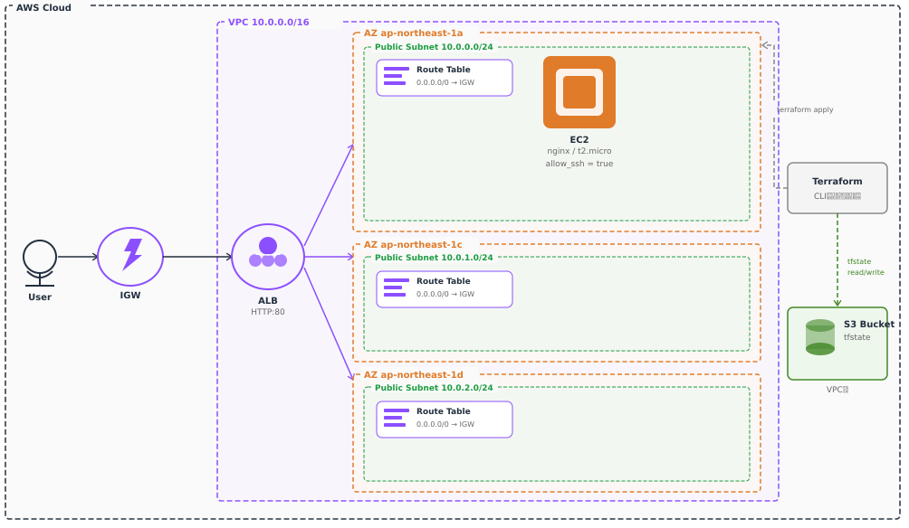

# udemy-terraform

UdemyのTerraformハンズオン講座で作成したAWSインフラのIaCコードです。

## 構成図



## ディレクトリ構成

```
udemy-terraform/
├── environments/
│   └── dev/
│       ├── backend.tf      # S3バックエンド設定
│       ├── main.tf         # モジュール呼び出し
│       ├── outputs.tf      # 出力値
│       └── provider.tf     # AWSプロバイダー設定
└── modules/
    ├── alb/
    │   ├── main.tf         # ALB・リスナー・ターゲットグループ定義
    │   ├── outputs.tf
    │   └── variables.tf
    ├── ec2/
    │   ├── main.tf         # EC2・セキュリティグループ定義
    │   ├── outputs.tf
    │   ├── user_data.sh    # nginx自動インストール
    │   └── variables.tf
    └── vpc/
        ├── main.tf         # VPC・サブネット・IGW・ルートテーブル定義
        └── outputs.tf
```

## 構成リソース

| リソース | 詳細 |
|---|---|
| VPC | CIDR: 10.0.0.0/16 |
| パブリックサブネット | 3AZ構成（ap-northeast-1a/c/d） |
| インターネットゲートウェイ | VPCにアタッチ |
| ルートテーブル | パブリックサブネット用 |
| EC2 | t2.micro / nginx自動インストール |
| ALB | Application Load Balancer / HTTP:80 |
| セキュリティグループ | ALB用・EC2用 |
| S3 | tfstateバックエンド |

## 使用技術

- Terraform v1.15.1
- AWS Provider v6.43.0
- AWS（VPC / EC2 / ALB / S3）

## 実行方法

```bash
cd environments/dev
terraform init
terraform plan
terraform apply
```
